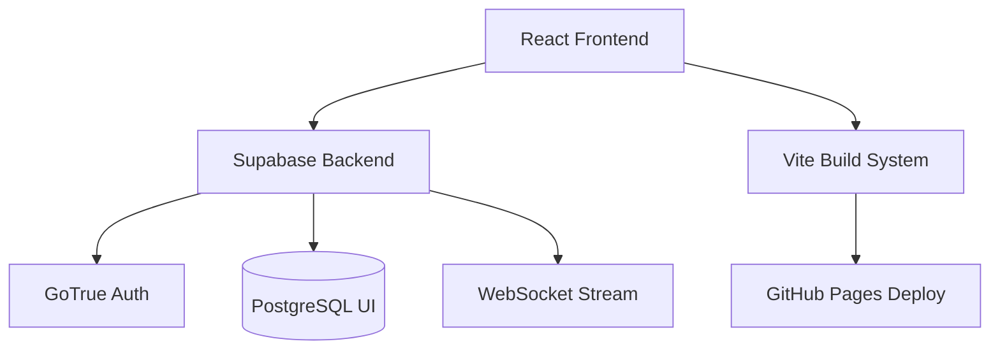

<div align="center">
  
</div>

<h1 align="center">ZimPay - Real-Time Banking Platform</h1>

<div align="center">
  <p><strong>A sleek, modern banking simulation built with React, TypeScript, and Supabase. Features real-time money transfers, row-level security, and a beautiful glassmorphic UI.</strong></p>
  
  <p>
    <a href="https://tapiwamakandigona.github.io/zimpay/"></a>
    
    
  </p>
</div>

---

## ⚡ Architecture Overview

ZimPay demonstrates how to build a highly interactive, secure FinTech application using modern web technologies. It leverages **Supabase** for backend-as-a-service, utilizing PostgreSQL's Row Level Security (RLS) to ensure that users can only ever access their own financial data.

## 💳 Core Features

| Feature | Implementation Details |
|---------|------------------------|
| **Real-Time Transfers** | Supabase real-time subscriptions instantly update balances |
| **Secure Auth** | Integrated email verification and JWT session management |
| **Row Level Security** | Database-enforced privacy (users cannot read others' balances) |
| **Glassmorphism UI** | Premium CSS styling with dynamic dark mode and fluid transitions |
| **Responsive Design** | Mobile-first dashboard layout optimized for all screen sizes |

---

## 🛠️ Technology Stack



---

## 🚀 Quick Start

```bash
git clone https://github.com/tapiwamakandigona/zimpay.git
cd zimpay
npm install

# Setup your Supabase keys
cp .env.example .env.local

npm run dev
```

---

<div align="center">
  <b>Built by <a href="https://github.com/tapiwamakandigona">Tapiwa Makandigona</a></b>
  <br/>
  <i>⭐ Star this repo if you find the real-time Supabase architecture helpful!</i>
</div>
